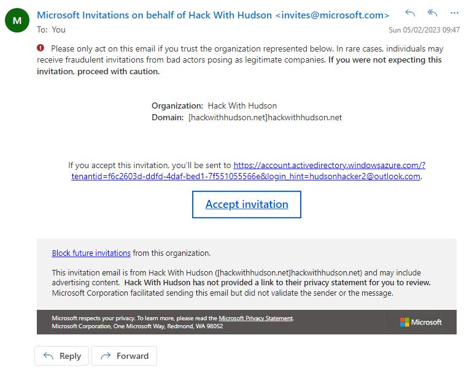
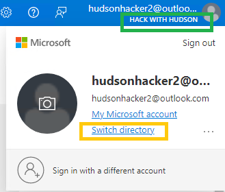

# Setup

Use the below checklist to make sure you'r ready for the Hackathon. Make sure you complete all the required setup steps so you can hit the ground running on the day!

1. [Microsoft Account](https://github.com/waynehoggett/AzureHackathons/blob/main/2%20-%20DevOps%20with%20GitHub/Setup/readme.md#microsoft-account)
2. [Accept Invite](https://github.com/waynehoggett/AzureHackathons/blob/main/2%20-%20DevOps%20with%20GitHub/Setup/readme.md#accept--invite)
3. [GitHub](https://github.com/waynehoggett/AzureHackathons/blob/main/2%20-%20DevOps%20with%20GitHub/Setup/readme.md#github)
4. [Software](https://github.com/waynehoggett/AzureHackathons/blob/main/2%20-%20DevOps%20with%20GitHub/Setup/readme.md#software)
5. [Azure](https://github.com/waynehoggett/AzureHackathons/blob/main/2%20-%20DevOps%20with%20GitHub/Setup/readme.md#software)

## Microsoft Account

You'll need a Microsoft Account, it's recommended you use a new Microsoft Account and use that new account to create your GitHub Account. Using a new account avoids issues with multiple tenants and potentially deploying resources to the wrong Azure tenant.

You can register for a new Microsoft Account here:
* [Create a Microsoft Account](https://signup.live.com/)

## Accept  Invite

Sent the email address of your Microsoft Account to the organizers. The organizers will invite you to the Azure Tenant used by the Hackathon. You will receive an invitation email (shown below). Accept the invitation before continuing.

After accepting the invite, you will be taken to `myapplications.microsoft.com`, you can close that tab, you'll access the Azure Portal using  `portal.azure.com`.

## GitHub

You will need your own free GitHub Account. It's recommended you use a NEW account for the hackathon so any older settings that are non-default don't cause you issues.

You can register for a Github Account here:
* [Create a GitHub Account](https://github.com/signup)

You'll also need a repository, you can create a repository once you have created your account, or, sign into GitHub and click the link below:

* [Create a Repository](https://github.com/new)

💡 IMPORTANT: Create a **🔖PUBLIC** repository for this hackathon so you can use all the features of GitHub.

## Software

Before the event you should prepare by downloading and installing the following:
 * Download and Install Visual Studio Code
 * Download and Install Git or GitHub Desktop

## Download and Install Visual Studio Code
Here are the instructions for your Operating System:
 * [macOS](https://code.visualstudio.com/docs/setup/mac)
 * [Linux](https://code.visualstudio.com/docs/setup/linux)
 * [Windows](https://code.visualstudio.com/docs/setup/windows)

## Download and Install Git
* [Git SCM](https://git-scm.com/download)

## (Optional) Download and Install GitHub Desktop
* [GitHub Desktop](https://desktop.github.com/)

## Azure

Use the Microsoft Account to login to Azure, and create a Resource Group that will be used to deploy your resources to, use a unique name, e.g. RG-<YourName>
  
1. Go to the [Azure Portal](https://portal.azure.com)
2. Log in with the Microsoft Account that has accepted the invitation
3. Make sure you have the correct tenant selected, and Change Directory if required
> 
4. [Create a Resource Group](https://learn.microsoft.com/en-us/azure/azure-resource-manager/management/manage-resource-groups-portal#create-resource-groups) for your Azure Resources

Note: You can use any region for your resource group, but stick to the Recommended regions, as displayed in the portal.
